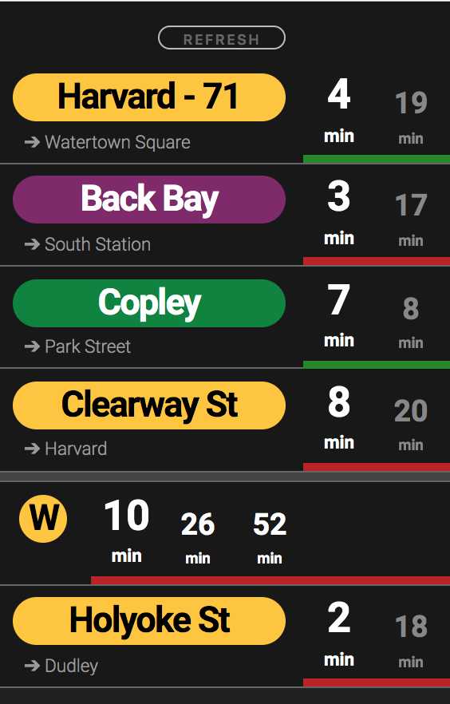

# Charlie

### Find out when the next train or bus is coming!



To customize, change stop info in `resources/routes.json`

---

_Note: For route/stop info, `mbta-client` (included in dependencies) has a few helper functions that provide route/stop IDs and direction names: `fetchAllRoutes` and `fetchStopsByRoute`. In `routes.json`, `direction` maps to the index of the stop's `direction_name`_

A green route signifies an arrival within your window of time, defined by `waitStart` and `waitLength` in `resources/routes.json`

Example: If it takes you 5 minutes to walk to the train, and you don't want to wait more than 5 minutes on the platform:

```
waitStart: 5
waitLength: 5
```
